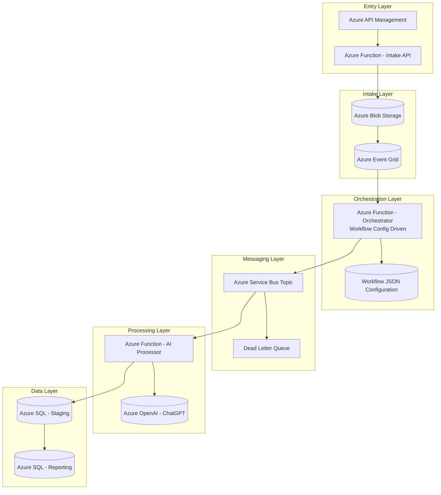
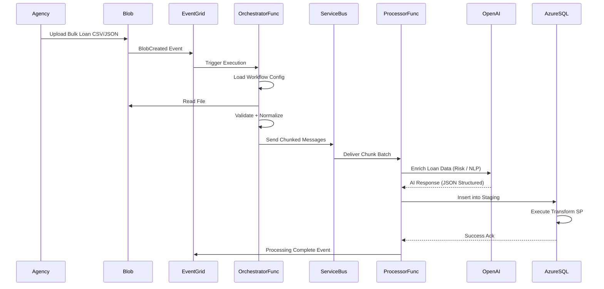

# Credit Loan Applicants


## 📘 Use Case: Bulk Loan Application Ingestion + AI-Powered Natural Language Reporting on Azure

---

# 🔥 Executive Summary (5 Lines)

Bulk loan files from agencies are ingested into Azure via secure Blob upload and processed using Azure Functions into Azure SQL. Clean structured data supports advanced reporting. Azure OpenAI converts natural language into secure SQL queries. Results are summarized intelligently for executives. The system transforms static reporting into conversational financial intelligence.

---

# 📊 Architecture Flow



---

# 🔄 Detailed Sequence Diagram



---


This aligns well with your **Xenhey workflow runtime** concept.

---

# 🔹 Azure Service Bus Strategy (Enterprise Safe)

### Why Service Bus?

| Feature             | Benefit                           |
| ------------------- | --------------------------------- |
| Chunk Processing    | Handles 500–1000 loans per batch  |
| Retry Policy        | Built-in exponential retry        |
| Dead Letter Queue   | Failed messages isolated          |
| Duplicate Detection | Prevents double insert            |
| Sessions            | Agency-level processing isolation |

---

# 🔹 Azure SQL Processing Design

### 1️⃣ Staging Insert

* Insert raw enriched records

### 2️⃣ Transform Procedure

```sql
EXEC reporting.usp_ProcessLoanBatch @BatchID
```

Handles:

* Deduplication
* Risk normalization
* Agency-level metrics update
* Audit logging

---

# 🤖 ChatGPT Enrichment Call (Azure OpenAI)

Processor Function sends structured JSON:

```json
{
  "LoanAmount": 250000,
  "CreditScore": 710,
  "Income": 120000,
  "LoanPurpose": "Home Improvement"
}
```

Prompt:

> Classify risk level (Low/Medium/High), provide probability score, and a short risk explanation.

AI Returns:

```json
{
  "RiskLevel": "Medium",
  "RiskScore": 0.64,
  "Explanation": "Debt-to-income ratio moderately elevated..."
}
```

Inserted directly into staging.

---

# 🛡️ Production Hardening

| Area            | Strategy                           |
| --------------- | ---------------------------------- |
| Large Files     | Chunk to 500 records               |
| Backpressure    | Service Bus queue depth monitoring |
| Poison Messages | DLQ with monitoring alert          |
| SQL Overload    | Batch insert via TVP               |
| Security        | Managed Identity for SQL           |
| Observability   | App Insights + Log Analytics       |
| Compliance      | SQL Audit + Defender               |

---

# 🔥 Logical Architecture Layers

---

# 📈 Why This Architecture Is Powerful

This design:

* Supports 500K+ loan uploads per day
* AI enriches data without rewriting core platform
* Decouples parsing from processing
* Handles spikes safely
* Enables near real-time reporting
* Supports natural language reporting on top of SQL

---

# 🎯 How Natural Language Reporting Connects

After SQL is populated:

User asks:

> “Which agencies had rising risk last month?”

Flow:

1. User → API
2. Azure Function → ChatGPT converts NL → SQL
3. SQL executed
4. AI summarizes results
5. Response displayed in UI

---

# 🏦 Enterprise-Grade Summary

This design enables bulk agency loan ingestion, AI-driven risk enrichment, chunk-safe processing via Service Bus, SQL reporting optimization, and conversational reporting — all without disrupting existing loan origination systems.

