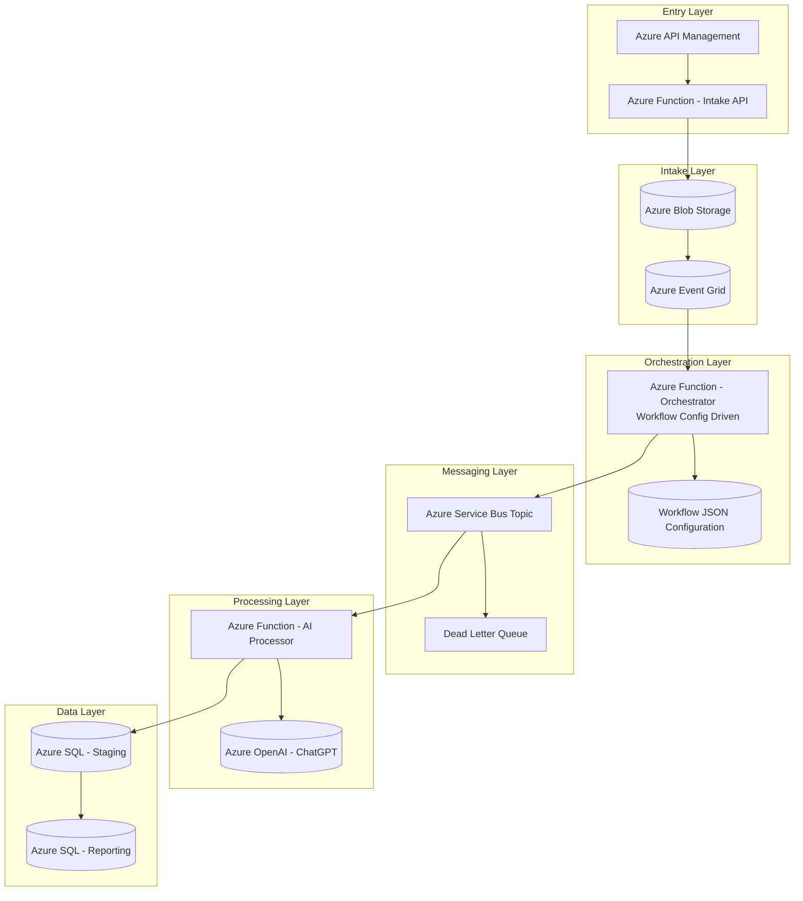
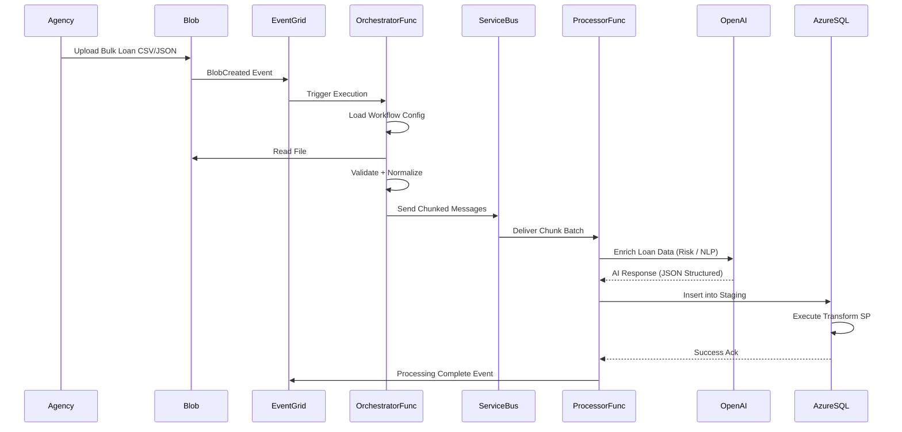

# Credit Loan Applicants


## 📘 Use Case: Bulk Loan Application Ingestion + AI-Powered Natural Language Reporting on Azure

---

# 🔥 Executive Summary

Bulk loan files from agencies are ingested into Azure via secure Blob upload and processed using Azure Functions into Azure SQL. Clean structured data supports advanced reporting. OpenAI converts natural language into secure SQL queries. Results are summarized intelligently for executives. The system transforms static reporting into conversational financial intelligence.

---

# 📊 Architecture Flow



---

# 🔄 Detailed Sequence Diagram



---


## What topics will be covered in the session

* **Azure Function App**

  * Exposes REST endpoints for **search**, **reporting**, and **data access**
  * Supports **traditional keyword search** and **Natural Language Search**
  * Integrates with **ChatGPT-4.1** to translate natural language questions into structured queries
 
* **Azure Service Bus**

  * Receives ingestion messages triggered by file arrivals or upstream systems
  * Decouples producers from consumers for reliable, scalable ingestion
  * Supports retry, dead-lettering, and ordered message processing

* **Azure SQL Database**

  * Stores ingested data using a **predefined relational schema**
  * Optimized for reporting, filtering, aggregations, and Power BI consumption
  * Enforces data integrity, constraints, and indexing strategies

* **Azure Table Storage**

  * Stores ingested data in a **schema-less (NoSQL) format**
  * Used for raw, semi-structured, or evolving datasets

* **Azure Storage Account (File Share)**

  * Receives inbound files via **SFTP**
  * Serves as the landing zone for batch and external partner data
  * Triggers ingestion workflows via storage events

* **Event-Driven Ingestion**

  * Storage events (file create/update) trigger Azure Functions
  * Functions publish messages to Service Bus for downstream processing
  * Enables scalable, asynchronous, near-real-time ingestion

* **Azure Application Insights**

  * Captures API request counts, response times, and failure rates
  * Tracks Function execution health and dependency performance
  * Enables fast troubleshooting and operational visibility

* **Natural Language Search (ChatGPT-4o Integration)**

  * Users submit free-form questions via API
  * ChatGPT-4o interprets intent and generates structured query logic
  * Results returned from SQL or Table Storage through the same API

* **Azure Container Instances (ACI)**

  * Hosts a **secure SFTP server**
  * Isolated, ephemeral compute with no VM management overhead
  * Integrates with Azure Storage File Shares for persistence

* **Azure Log Analytics**

  * Centralizes ingestion, processing, and pipeline telemetry
  * Displays near-real-time **ingestion progress charts**
  * Supports KQL queries for operational dashboards and alerts


Set Up Steps 

Creating a serverless API using Azure that leverages Service Bus to communicate with an SQL Database involves several steps. Here's a high-level overview of how you can set this up:

1. **Set Up Azure SQL Database**:
   - Create an Azure SQL Database instance.
   - Set up the necessary tables and schemas you'll need for your application.

2. **Create Azure Service Bus**:
   - Set up an Azure Service Bus namespace.
   - Within the namespace, create a queue or topic (based on your requirement).

3. **Deploy Serverless API using Azure Functions**:
   - Create a new Azure Function App.
   - Develop an HTTP-triggered function that will act as your API endpoint.
   - In this function, when data is received, send a message to the Service Bus queue or topic.

4. **Deploy 2 Service Bus Triggered Function**:
   - Create another Azure Function that is triggered by the Service Bus queue or topic.
   - This function will read the message from the Service Bus and process it. The processing might involve parsing the message and inserting the data into the Azure SQL Database.

5. **Deploy a Timer Triggered Function**:
   - Create another Azure Function that is triggered when a file is dropped in a container.
   - This function will stream in a file, read it and place on the service bus topic.

6. **Implement Error Handling**:
   - Ensure that you have error handling in place. If there's a failure in processing the message and inserting it into the database, you might want to log the error or move the message to a dead-letter queue.

7. **Secure Your Functions**:
   - Ensure that your HTTP-triggered function (API endpoint) is secured, possibly using Azure Active Directory or function keys.

8. **Optimize & Monitor**:
   - Monitor the performance of your functions using Azure Monitor and Application Insights.
   - Optimize the performance, scalability, and cost by adjusting the function's plan (Consumption Plan, Premium Plan, etc.) and tweaking the configurations.

9. **Deployment**:
   - Deploy your functions to the Azure environment. You can use CI/CD pipelines using tools like Azure DevOps or GitHub Actions for automated deployments.

By following these steps, you'll have a serverless API in Azure that uses Service Bus as a mediator to process data and store it in an SQL Database. This architecture ensures decoupling between data ingestion and processing, adding a layer of resilience and scalability to your solution.


## Appplication Setting 

|Key|Value | Comment|
|:----|:----|:----|
|AzureWebJobsStorage|[CONNECTION STRING]|RECOMMENDATION :  store in AzureKey Vault.|
|ConfigurationPath| [CONFIGURATION FOLDER PATH] |Folder is optional if remote config is been used.
|ApiStore| [Remote Configuration Store]  | Connect to your remote config store
|ApiKeyName|[API KEY NAME]|Will be passed in the header  :  the file name of the config.
|AppName| [APPLICATION NAME]| This is the name of the Function App, used in log analytics|
|StorageAcctName|[STORAGE ACCOUNT NAME]|Example  "AzureWebJobsStorage"|
|ServiceBusConnectionString|[SERVICE BUS CONNECTION STRING]|Example  "ServiceBusConnectionString".  Recommmended to store in Key vault.|
|DatabaseConnection|[DATABASE CONNECTION STRING]|Example  "DatabaseConnection". Recommmended to store in Key vault.|
|TimerInterval|[TIMER_INTERVAL]|Example  "0 */1 * * * *" 1 MIN|


> **Note:**  Look at the configuration file in the **Config** Folder and created a Table to record information.

## Configuration Files 

> **Note:** The **Configuration** is located in the  FunctionApp  in a **Config** Folder.

|FileName|Description|
|:----|:----|
|[FA7BDA37345D4F4881A7473ACDF06B4A.json](https://www.xenhey.com/api/store/FA7BDA37345D4F4881A7473ACDF06B4A)| **Upload File** Parse CSV file --> Write Batched Files To Storage|
|[35C8400673BD4566AF97227BBC7A2754.json](https://www.xenhey.com/api/store/35C8400673BD4566AF97227BBC7A2754)| **File Parser Event Trigger** Parse CSV file --> File received from SFTP will use this process to parse files|
|[269CA9B3A0B542E3A5BB713005D591F7.json](https://www.xenhey.com/api/store/269CA9B3A0B542E3A5BB713005D591F7)| **Service Bus Trigger for SQL DB** | Receive JSON payload and insert into SQL DB|
|[00766FE7DC3E469CB8E3416B9BC6A26C.json](https://www.xenhey.com/api/store/00766FE7DC3E469CB8E3416B9BC6A26C)| **Service Bus Trigger for No SQL DB** | Receive JSON payload and insert into NO SQL DB|
|[2484F9382E974133A216F8E39BF4C389.json](https://www.xenhey.com/api/store/2484F9382E974133A216F8E39BF4C389)| **File Drop Event Trigger** Send parsed/sharded file  to Send to Service Bus|
|[C1D791EBB8BF4491A61E3659298F46E8.json](https://www.xenhey.com/api/store/C1D791EBB8BF4491A61E3659298F46E8)| **Search Resullt from NO SQLDB** |
|[FC8AFFD1677A443D9D2A962A79246372.json](https://www.xenhey.com/api/store/FC8AFFD1677A443D9D2A962A79246372)| **Search SQL DB. Return resultset** |
|[C51F7629130B448AB4430D1260360C1E.json](https://www.xenhey.com/api/store/C51F7629130B448AB4430D1260360C1E)| **Copy File from SFTP into the pickup folder** |
|[68AA07F5193441878BFCD5CB372B25FB.json](https://www.xenhey.com/api/store/68AA07F5193441878BFCD5CB372B25FB)| **Create a new Record in NoSQL Database** |
|[21B8411B3EA24285B52F24B1D968B68A.json](https://www.xenhey.com/api/store/21B8411B3EA24285B52F24B1D968B68A)| **AI Search using Chat GPT Natual Language Processor** |


> Create the following blob containers and share in azure storage

|ContainerName|Description|
|:----|:----|
|config|Location for the configuration files. Only Required for Managed Storage|
|pickup|Thes are files that are copied from the SFTP share and dropped in the pickup container |
|processed|These are files the have been parsed and dropped in th processed container|

|Table|Description|
|:----|:----|
|csvbatchfiles|Track the CSV parsed files|
|training[YYYYMMDD]|N0 SQL DataStore|


|Share|Description|
|:----|:----|
|training[YYYYMMDD]|Create a share location for SFTP to drop files|

## Service Bus Subscription information

|Subscription Name|Description|
|:----|:----|
|request|Create a Topic|
|nosqlmessage|Create a Subscription|
|sqlmessage|Create a Subscription|

## Upgrade Storage 
Update storage account to Azure Data Lake Storage(ADLS) then run the following script 
## Script provsion an Event Grid
```powershell
$subscriptions = ""
$resourceGroups = "training20260107"
$storageAccounts = "training20260107"
$functionAppName = "training20260107"
$function = "Filedroptrigger"
$function1 = "FileParser"
$containerName = "processed"
$containerName1 = "pickup"
az eventgrid event-subscription create `
  --name blob-monitor-processed `
  --source-resource-id "/subscriptions/$subscriptions/resourceGroups/$resourceGroups/providers/Microsoft.Storage/storageAccounts/$storageAccounts" `
  --included-event-types Microsoft.Storage.BlobCreated  `
  --endpoint-type azurefunction `
  --endpoint "/subscriptions/$subscriptions/resourceGroups/$resourceGroups/providers/Microsoft.Web/sites/$functionAppName/functions/$function" `
  --advanced-filter data.blobType StringContains BlockBlob `
  --advanced-filter subject StringBeginsWith "/blobServices/default/containers/$containerName/"


  az eventgrid event-subscription create `
  --name stp `
  --source-resource-id "/subscriptions/$subscriptions/resourceGroups/$resourceGroups/providers/Microsoft.Storage/storageAccounts/$storageAccounts" `
  --included-event-types Microsoft.Storage.BlobCreated  `
  --endpoint-type azurefunction `
  --endpoint "/subscriptions/$subscriptions/resourceGroups/$resourceGroups/providers/Microsoft.Web/sites/$functionAppName/functions/$function1" `
  --advanced-filter data.blobType StringContains BlockBlob `
  --advanced-filter subject StringBeginsWith "/blobServices/default/containers/$containerName1/"
```
## Create Azure Container Instance for SFTP
> User the following link to create a Azure Container Instance(ACI for SFTP)
> 
https://docs.microsoft.com/en-us/samples/azure-samples/sftp-creation-template/sftp-on-azure


> Kusto Queries used for Application Insights

```
search "ReceiveMessageFromServieBus"
| summarize count() by bin(timestamp, 1h)
| order by timestamp desc    

```
```
customEvents
| where isnotnull(customDimensions.ProcessName)
//| where customDimensions.ProcessName == 'ReceiveMessageFromServieBus'  
| summarize count() by bin(timestamp, 1m),  Key = tostring(customDimensions.ProcessName) 
| order by timestamp desc
| render columnchart
``` 
  
  
## Products

|products|links|Comments|
|:----|:----|:----|
|Azure Getting Started |https://azure.microsoft.com/en-us/free/| Create free account + $200 in Credit|
|Sample Data Sets|https://www.kaggle.com/datasets| Useful site for pulling sample payload|
|Azure Storage Explorer|https://azure.microsoft.com/en-us/features/storage-explorer/#features|useful view and query data in azure table storage|
|Postman|https://www.postman.com/downloads/|Postman supports the Web or Desktop Version|
|VsCode| https://visualstudio.microsoft.com/downloads/ |  Required extensions. Azure Functions, Azure Account
|VS Studio Community Edition |https://visualstudio.microsoft.com/downloads/| Recommended. Nice intergration with Azure. software is free.
|Liquid Template|https://liquidjs.com/tutorials/intro-to-liquid.html|

  ## Configuration-driven development
 
 "Configuration-driven development," refers to an approach in software development where the behavior and functionality of an application are primarily controlled through configuration files, rather than writing code. It focuses on separating application logic from configuration parameters, allowing developers to easily modify the behavior of the software without the need for extensive code changes.  [Xenhey.BPM.Core.Net8](https://www.nuget.org/packages/Xenhey.BPM.Core.Net8) offers a orchrestration pipeline using configuration to drive the execution of business logic, providing a tailored solution for each Line Of Business(LOB). The following are some benefits. 

 1. Flexibility: By using configuration files, developers can easily tweak and adjust the application's behavior without modifying the underlying code. It allows for quick customization and adaptation to different scenarios or client requirements.

2. Maintenance: Separating configuration from code simplifies maintenance processes. Updates and modifications can be made by adjusting the configuration files, reducing the risk of introducing bugs or breaking existing functionality. It also facilitates version control and collaboration, as changes to configuration can be tracked separately from code changes.

3. Scalability: Configuration-driven development promotes scalability by enabling the application to handle different environments, configurations, or user preferences. It allows for seamless deployment across multiple instances or environments with minimal code changes.

4. Testing and Validation: Configuration-driven development enhances testing and validation processes. Since configuration changes are isolated from the codebase, it becomes easier to verify the impact of different configurations on the application's behavior. It also facilitates A/B testing or experimentation by quickly switching between different configurations.

5. Domain-Specific Customization: Configuration-driven development enables domain-specific customization by providing options and settings tailored to specific use cases. This empowers non-technical users or administrators to configure the application according to their specific requirements without the need for coding expertise


  ## Contact
  
For questions related to this project, can be reached via email :- support@xenhey.com

